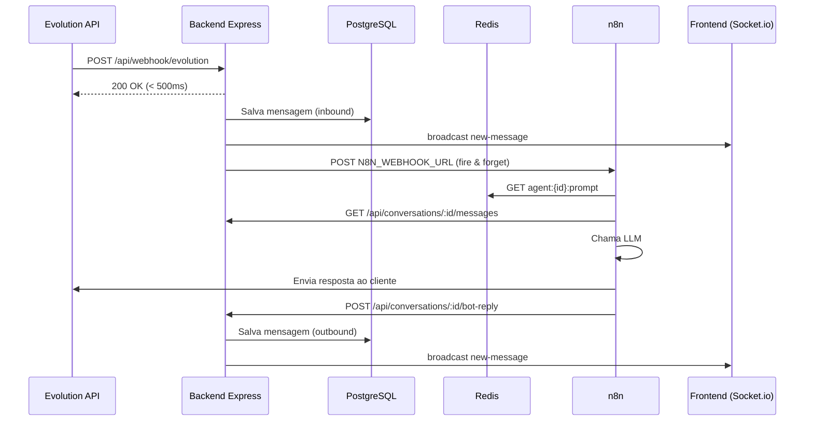

# Mega CRM — Backend Walkthrough

## Resumo

Backend completo do Mega CRM implementado do zero seguindo o documento mestre v2.0. **40 arquivos criados**, cobrindo todas as 11 etapas de desenvolvimento + 3 correções de segurança/ops.

---

## Estrutura Final

```
mega-crm/
├── .env.example                          ← Template de variáveis
├── .env                                  ← Env local (copiado do example)
├── .gitignore
├── docker-compose.yml                    ← Produção (PG + Redis + Backend)
├── docker-compose.dev.yml                ← Override dev (nodemon)
│
└── backend/
    ├── package.json                      ← 14 deps + nodemon
    ├── Dockerfile                        ← Node 20 Alpine + healthcheck
    ├── .dockerignore
    └── src/
        ├── app.js                        ← Express app (middlewares + rotas)
        ├── server.js                     ← Entry point (startup sequencial)
        │
        ├── config/
        │   ├── env.js                    ← Validação Zod (fail fast)
        │   ├── database.js               ← Knex + PostgreSQL
        │   └── redis.js                  ← ioredis (lazy connect)
        │
        ├── middleware/
        │   ├── auth.js                   ← JWT verify + requireRole()
        │   ├── internalAuth.js           ← x-internal-secret + authOrInternal
        │   ├── errorHandler.js           ← Handler global (Zod, JWT, PG)
        │   ├── validate.js               ← Factory validate(schema)
        │   └── webhookValidator.js        ← HMAC-SHA256 Evolution
        │
        ├── routes/
        │   ├── index.js                  ← Agregador com hierarquia de auth
        │   ├── auth.routes.js            ← login, refresh, me
        │   ├── contacts.routes.js        ← CRUD + paginação + filtros
        │   ├── pipeline.routes.js        ← stages + cards (drag&drop + WS)
        │   ├── conversations.routes.js   ← lista, histórico, assign, close, bot-reply
        │   ├── agents.routes.js          ← CRUD + sync Redis
        │   ├── settings.routes.js        ← GET/PUT + sync Redis
        │   ├── stats.routes.js           ← Métricas dashboard
        │   └── webhook.routes.js         ← Evolution API (200 OK imediato)
        │
        ├── services/
        │   ├── n8n.service.js            ← Fire & forget HTTP POST
        │   ├── redis.service.js          ← CRUD Redis + syncAllFromDatabase()
        │   └── socket.service.js         ← Auth JWT + rooms + broadcasts
        │
        └── db/
            ├── knexfile.js               ← Config dev/prod/test
            ├── migrations/               ← 8 migrations
            │   ├── 001_create_users.js
            │   ├── 002_create_contacts.js
            │   ├── 003_create_pipeline_stages.js
            │   ├── 004_create_pipeline_cards.js
            │   ├── 005_create_conversations.js
            │   ├── 006_create_messages.js
            │   ├── 007_create_ai_agents.js
            │   └── 008_create_settings.js
            └── seeds/
                ├── 001_admin_user.js      ← admin@megacrm.com / admin123
                └── 002_pipeline_stages.js ← 8 estágios do Kanban
```

---

## Arquitetura Implementada

### Fluxo de Mensagem (Webhook → n8n → Frontend)



### Startup Sequencial do Server

```
1. ENV       → Validação Zod (crasha se faltar)
2. BANCO     → Testa conexão PostgreSQL
3. MIGRATE   → Se AUTO_MIGRATE=true (default em dev, skip em prod)
4. REDIS     → Conecta ioredis
5. SYNC      → syncAllFromDatabase() (banco → Redis)
6. SECURITY  → Checa senha fraca do admin em produção
7. SOCKET    → Inicializa Socket.io com JWT
8. LISTEN    → Porta 3001
```

---

## Endpoints da API

| Método | Rota | Auth | Descrição |
|--------|------|------|-----------|
| GET | `/api/health` | — | Healthcheck |
| POST | `/api/auth/login` | — | Login → JWT |
| POST | `/api/auth/refresh` | JWT | Renova token |
| GET | `/api/auth/me` | JWT | Dados do usuário |
| GET | `/api/contacts` | JWT | Lista com paginação/filtros |
| POST | `/api/contacts` | JWT | Cria contato |
| PUT | `/api/contacts/:id` | JWT | Atualiza contato |
| GET | `/api/contacts/:id` | JWT | Detalhes + conversas |
| GET | `/api/pipeline/stages` | JWT | Lista stages do Kanban |
| GET | `/api/pipeline/cards` | JWT | Lista cards |
| POST | `/api/pipeline/cards` | JWT | Cria card |
| PUT | `/api/pipeline/cards/:id` | JWT | Move card (drag&drop) |
| GET | `/api/conversations` | JWT ou Internal | Lista conversas abertas |
| GET | `/api/conversations/:id/messages` | JWT ou Internal | Histórico mensagens |
| PUT | `/api/conversations/:id/assign` | JWT ou Internal | Humano assume |
| PUT | `/api/conversations/:id/close` | JWT ou Internal | Fecha conversa |
| POST | `/api/conversations/:id/bot-reply` | JWT ou Internal | Callback n8n |
| POST | `/api/webhook/evolution` | HMAC | Webhook Evolution |
| GET | `/api/agents` | Admin | Lista agentes IA |
| POST | `/api/agents` | Admin | Cria agente + Redis |
| PUT | `/api/agents/:id` | Admin | Atualiza agente + Redis |
| DELETE | `/api/agents/:id` | Admin | Remove agente + Redis |
| GET | `/api/settings` | Admin | Configurações globais |
| PUT | `/api/settings` | Admin | Atualiza configs + Redis |
| GET | `/api/stats` | JWT | Métricas dashboard |

---

## Verificação Realizada

| Check | Resultado |
|-------|-----------|
| npm install | ✅ 204 packages instalados |
| Require tree | ✅ Todos módulos carregam sem erro |
| Zod validation | ✅ Crasha corretamente sem .env |
| CommonJS | ✅ 100% require/module.exports |
| Express 4 | ✅ Sem Express 5, sem ES Modules |

---

## Correções de Segurança (v1.1)

| Problema | Correção |
|----------|----------|
| bot-reply sem auth | Protegido com header `x-internal-secret` (INTERNAL_SECRET no .env). O n8n envia o header, o backend valida. |
| Seed admin com senha fraca | Em produção, se `admin@megacrm.com` ainda tem a senha `admin123`, loga warning vermelho no startup. |
| Migrations automáticas em prod | Controlado por `AUTO_MIGRATE` no .env. Em dev: roda automaticamente. Em prod: pula e avisa quantas estão pendentes. |

### Config do n8n para bot-reply

No workflow do n8n, no nó HTTP Request que chama `POST /api/conversations/:id/bot-reply`, adicione o header:

```
x-internal-secret: <valor do INTERNAL_SECRET no .env do backend>
```

---

## Como Rodar

```bash
# 1. Copiar env e configurar
cp .env.example .env
# Edite o .env com seus valores reais

# 2. Subir PostgreSQL e Redis via Docker
docker compose up -d postgres redis

# 3. Instalar deps e rodar
cd backend
npm install
npm run migrate
npm run seed
npm run dev

# 4. Testar
# http://localhost:3001/api/health
# POST http://localhost:3001/api/auth/login
#   body: { "email": "admin@megacrm.com", "password": "admin123" }
```

---

## Próximos Passos

- **Testar com Docker** (PG + Redis locais) para validar migrations e seeds
- **Frontend** (Fase 2) — React + Vite com o design dark premium das referências
- **Deploy** — Docker Compose na VPS via Coolify
- **Fluxo n8n** — Montar workflow no n8n usando o JSON de referência
